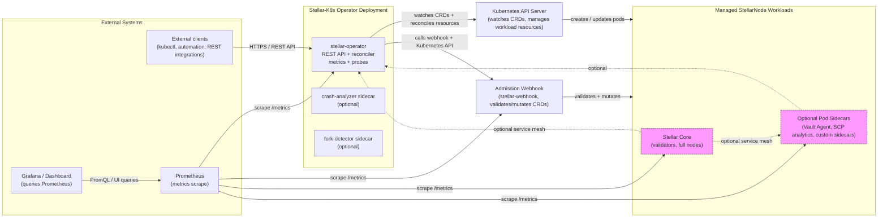

# Architecture Overview

The Stellar-K8s architecture is centered on a Kubernetes-native operator that manages Stellar Core clusters through `StellarNode` custom resources. The current design includes:

- A control-plane operator deployment that exposes a REST API, metrics, health probes, and a reconciliation loop.
- A separate admission webhook and CRD validation layer.
- Managed Stellar Core workloads with optional application sidecars.
- A monitoring stack that collects operator, webhook, and workload telemetry.
- Optional service mesh integration for transparent pod-to-pod mTLS.

## Key components

### 1. Operator control plane

The `stellar-operator` deployment is the central control plane. It runs the reconciliation loop and exposes:

- A REST API for cluster management and observability.
- Prometheus-compatible metrics via `/metrics`.
- Kubernetes health probes.
- CRD watching and reconciliation of StellarNode resources.

The operator may also run additional diagnostic containers inside the same pod, such as crash analysis or fork detection sidecars.

### 2. REST API

The operator REST API provides external access to operator state and cluster metadata. Typical endpoints include:

- `/health`, `/healthz`, `/readyz`, `/livez`
- `/leader`
- `/api/v1/nodes`
- `/api/v1/nodes/:namespace/:name`
- `/metrics`
- `/`
- `/config/log-level`

This API is the integration point for CLI tools, automation, dashboards, and custom workflows.

### 3. Admission webhook

A separate `stellar-webhook` component validates and mutates `StellarNode` custom resources. It enforces security and configuration policies before the operator reconciles workloads.

### 4. Managed StellarNode workloads and sidecars

Each `StellarNode` becomes one or more Kubernetes workloads representing Stellar Core processes. Those pods can include:

- the main Stellar Core container
- optional operator-managed sidecars for features such as Vault Agent injection, SCP analytics, or specialized monitoring workloads
- an injected service mesh proxy when Istio/Linkerd integration is enabled

### 5. Monitoring stack

The monitoring stack collects telemetry from the operator, webhook, and managed workloads:

- `Prometheus` scrapes `/metrics` endpoints from the operator, webhook, and node-side components.
- `Grafana` and the operator dashboard query Prometheus for cluster health, node status, and observability dashboards.

## Architecture alignment with current codebase

The current Helm chart configuration shows:

- `operator.restApiEnabled: true`
- `operator.restApiPort: 9090`
- `operator.metricsPort: 9090`
- `service.restApiPort: 9090`
- `service.metricsPort: 9090`
- `sidecar.enabled: true` for diagnostic sidecars alongside the operator pod

This means the latest architecture emphasizes a single operator service bound to the REST API and metrics port, with optional auxiliary sidecars and a full monitoring pipeline.

## Optional service mesh support

When service mesh integration is enabled, sidecar proxies such as Istio Envoy or Linkerd proxy are injected alongside Stellar pods. The mesh intercepts pod traffic and provides mTLS, while the operator continues to manage resources through Kubernetes APIs.

## Why this diagram matters

This updated architecture view reflects the current codebase and documentation priorities:

- the operator is more than a reconciler; it is also an API and metrics endpoint
- sidecars are now first-class managed components in both operator and workload pods
- monitoring is an explicit part of the platform, not an afterthought
- webhook validation remains a critical control point for safe deployment
